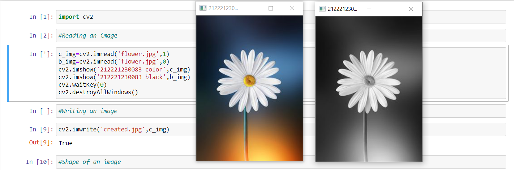
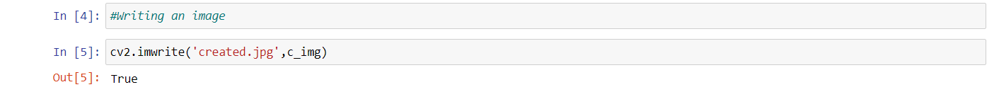
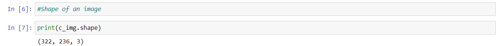
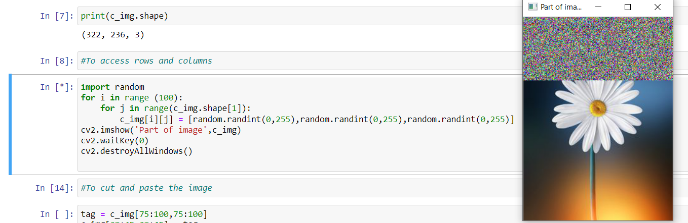
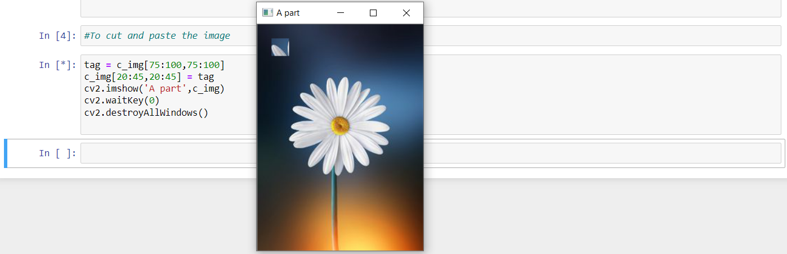

# EXPERIMENT 1: READ AND WRITE AN IMAGE
## AIM:
To write a python program using OpenCV to do the following image manipulations.
i) Read, display, and write an image.
ii) Access the rows and columns in an image.
iii) Cut and paste a small portion of the image.

## SOFTWARE REQUIRED:
Anaconda - Python 3.7
## ALGORITHM:
### Step1:
Choose an image and save it as a filename.jpg.
### Step2:
Use imread(filename, flags) to read the file.
### Step3:
Use imshow(window_name, image) to display the image.
### Step4:
Use imwrite(filename, image) to write the image.
### Step5:
End the program and close the output image windows.
## PROGRAM:
### Developed By: Rithiga Sri.B
### Register Number: 212221230083
### (i) To read and display the image:
```
c_img=cv2.imread('flower.jpg',1)
b_img=cv2.imread('flower.jpg',0)
cv2.imshow('212221230083 color',c_img)
cv2.imshow('212221230083 black',b_img)
cv2.waitKey(0)
cv2.destroyAllWindows()
```
### (ii)To write the image:
```
cv2.imwrite('created.jpg',c_img)
```
### (iii) Find the shape of the Image:
```
print(c_img.shape)
```
### (iv)To access rows and columns:
```
import random
for i in range (100):
    for j in range(c_img.shape[1]):
        c_img[i][j] = [random.randint(0,255),random.randint(0,255),random.randint(0,255)]  
cv2.imshow('Part of image',c_img)
cv2.waitKey(0)
cv2.destroyAllWindows()
```
### (v)To cut and paste portion of image:
```
tag = c_img[75:100,75:100]
c_img[20:45,20:45] = tag
cv2.imshow('A part',c_img)
cv2.waitKey(0)
cv2.destroyAllWindows()
```

## OUTPUT:
### (i) Read and display the image:

### (ii)Write the image:

### (iii)Shape of the Image:

### (iv)Access rows and columns:

### (v)Cut and paste portion of image:

## RESULT:
Thus the images are read, displayed, and written successfully using the python program.


